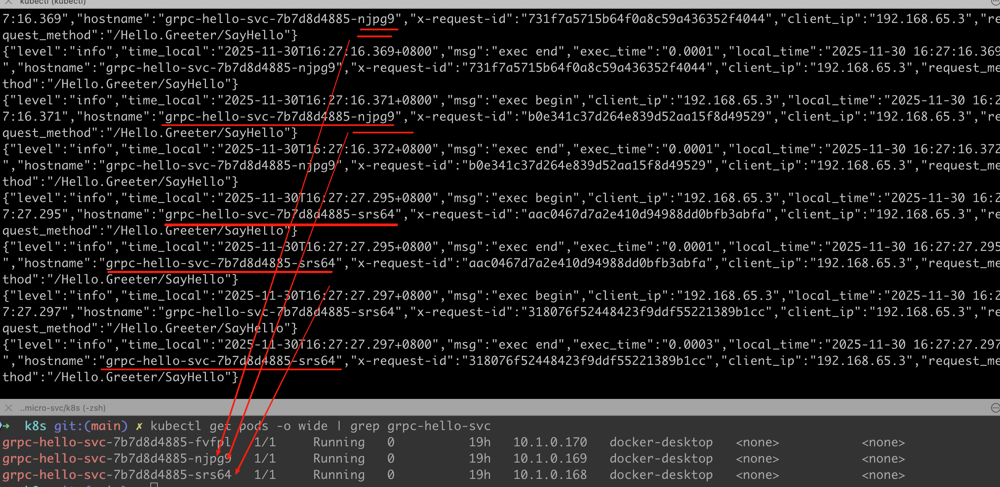
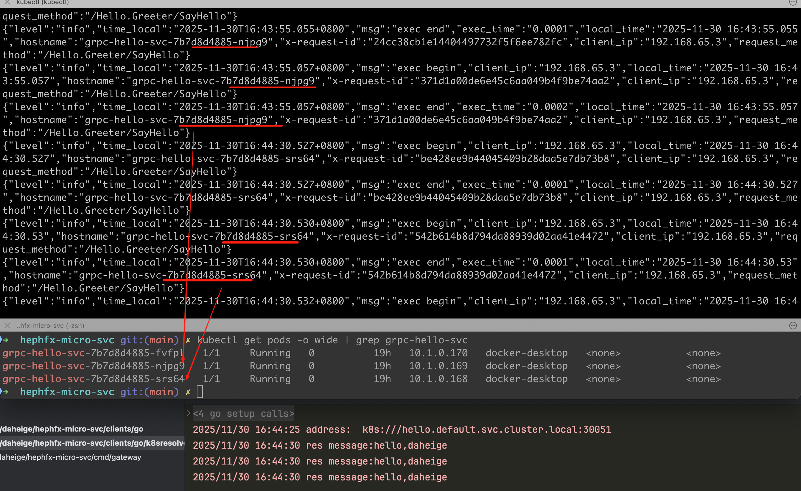

# deployment
```shell
kubectl apply -f deployment.yaml
```

# service
```shell
kubectl apply -f service.yaml
```

# port proxy
本地端口转发快速开发和调试
```shell
kubectl port-forward service/grpc-hello-svc 50051:50051 &
kubectl port-forward service/grpc-hello-svc 8090:8090 &
```

或者通过node-port方式将请求转发到50051和8090端口
```shell
kubectl apply -f service-node-port.yaml
```
查看运行的服务
```shell
kubectl get svc -o wide | grep grpc-hello-node-port
```
运行结果如下：
```ini
grpc-hello-node-port   NodePort    10.100.214.218   <none>        50051:30051/TCP,8090:30052/TCP   10m    app=grpc-hello-svc
```
此时，我们可以使用k8s命名服务请求grpc服务，示例代码如下：
```shell
package main

import (
	"context"
	"log"

	"google.golang.org/grpc"
	"google.golang.org/grpc/credentials/insecure"

	"github.com/daheige/hephfx-micro-svc/pb"
)

func main() {
	// 通过k8s命名服务访问grpc服务端口，它会轮询服务端的pods节点处理grpc请求，因为此时采用的是headless方式
	address := "hello.default.svc.cluster.local:30051"
	log.Println("address: ", address)

	// Set up a connection to the server.
	clientConn, err := grpc.NewClient(
		address,
		// 如果使用k8s命名服务以及headless方式访问，需要打开下面的注释，实现客户端负载均衡
		// 关键配置：启用round_robin负载均衡策略
		grpc.WithDefaultServiceConfig(`{"loadBalancingConfig": [{"round_robin":{}}]}`),
		grpc.WithTransportCredentials(insecure.NewCredentials()),
	)
	if err != nil {
		log.Fatalf("failed to connect: %v", err)
	}

	defer func() {
		_ = clientConn.Close()
	}()

	client := pb.NewGreeterClient(clientConn)

	// Contact the server and print out its response.
	for i := 0; i < 100; i++ {
		res, err := client.SayHello(context.Background(), &pb.HelloReq{
			Name: "daheige",
		})
		if err != nil {
			log.Fatalf("could not greet: %v", err)
		}

		log.Printf("res message:%s", res.Message)
	}
}
```
运行结果如下：

从运行结果可以查看，使用k8s headless方式，grpc客户端请求采用轮询机制实现负责均衡，每个请求会分发到不同的pods节点上去。

# k8s pods
查看部署的pods
```shell
# kubectl get pods -o wide -n default
kubectl get pods -o wide | grep grpc-hello-svc
```
运行结果如下：
```ini
NAME                              READY   STATUS    RESTARTS   AGE   IP           NODE             NOMINATED NODE   READINESS GATES
grpc-hello-svc-7b7d8d4885-fvfpl   1/1     Running   0          19h   10.1.0.170   docker-desktop   <none>           <none>
grpc-hello-svc-7b7d8d4885-njpg9   1/1     Running   0          19h   10.1.0.169   docker-desktop   <none>           <none>
grpc-hello-svc-7b7d8d4885-srs64   1/1     Running   0          19h   10.1.0.168   docker-desktop   <none>           <none>
```

# k8s logs
查看k8s部署的服务日志
```shell
kubectl logs -l app=grpc-hello-svc -f
```

# k8s svc
查看启动的服务
```shell
kubectl get svc -o wide
```
输出结果：
```ini
NAME                   TYPE        CLUSTER-IP       EXTERNAL-IP   PORT(S)                          AGE     SELECTOR
grpc-hello-node-port   NodePort    10.100.214.218   <none>        50051:30051/TCP,8090:30052/TCP   7m54s   app=grpc-hello-svc
grpc-hello-svc         ClusterIP   None             <none>        50051/TCP,8090/TCP               19h     app=grpc-hello-svc
kubernetes             ClusterIP   10.96.0.1        <none>        443/TCP                          123d    <none>
```

# k8s resolver
自定义k8s服务发现和注册，参考`clients/go/k8sresolver`实现，运行效果如下：


# k8s hpa
gRPC 服务配置自动扩容，可以通过创建 Horizontal Pod Autoscaler (HPA) 来实现，执行如下命令创建hpa
```shell
kubectl apply -f hpa.yaml
```
