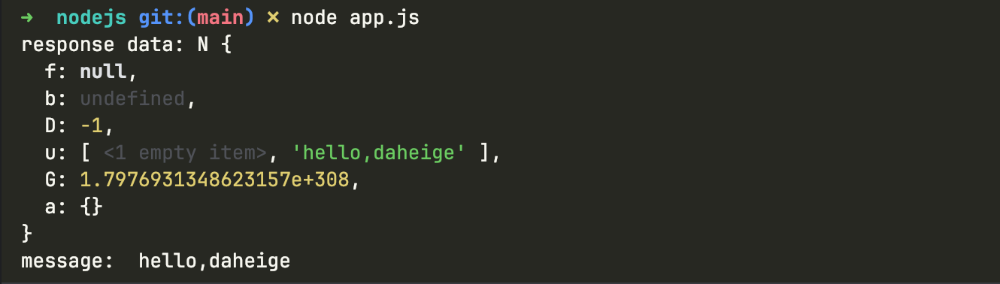

# hephfx-micro-svc
- hephfx micro微服务实战
- hephfx: https://github.com/daheige/hephfx
- 支持grpc server and grpc http gateway 启动

# gen code for Go
1. 先执行如下命令安装必要的go tools
```shell
sh bin/grpc_tools.sh
```

2. 执行如下命令实现go代码生成
```shell
sh bin/go-generate.sh
```

一般来说，生成的pb代码，建议放在独立git仓库中，方便集中式管理和维护。

# start running
1. 先运行命令`go run cmd/rpc/main.go`启动服务端。
2. 接着执行`go run clients/go/main.go`运行客户端。

# grpc gateway
1. 需要在proto文件添加如下核心配置
```protobuf
import "google/api/annotations.proto";

// Greeter service 定义开放调用的服务
service Greeter {
    rpc SayHello (HelloReq) returns (HelloReply){
        option (google.api.http) = {
            get: "/v1/say/{id}"
        };
    };
}
```
2. 执行`go run cmd/gateway/main.go`即可（启动之前，需要先启动rpc服务端）。

# grpc grpcurl tools
- grpcurl工具主要用于grpcurl请求，可以快速查看grpc proto定义以及调用grpc service定义的方法。
- grpcurl参考地址：https://github.com/fullstorydev/grpcurl

1. 安装grpcurl工具
```shell
brew install grpcurl
```
如果你本地安装了golang，那可以直接运行如下命令，安装grpcurl工具
```shell
go install github.com/fullstorydev/grpcurl/cmd/grpcurl@latest
```
2. 验证grpc service启动的效果
```shell
# 50051 是grpc微服务的端口
grpcurl -plaintext 127.0.0.1:50051 list
```

执行上面的命令，输出结果如下：
```ini
Hello.Greeter
grpc.reflection.v1.ServerReflection
grpc.reflection.v1alpha.ServerReflection
```
3. 查看proto文件定义的所有方法
```shell
grpcurl -plaintext 127.0.0.1:50051 describe Hello.Greeter
```
输出结果如下：
```ini
Hello.Greeter is a service:
service Greeter {
  rpc SayHello ( .Hello.HelloReq ) returns ( .Hello.HelloReply ) {
    option (.google.api.http) = { get: "/v1/say/{name}" };
  }
}
```
4. 查看请求参数定义
```shell
grpcurl -plaintext 127.0.0.1:50051 describe Hello.HelloReq
```
输出结果如下：
```ini
Hello.HelloReq is a message:
message HelloReq {
  string name = 1;
}
```
5. 请求grpc方法
```shell
grpcurl -d '{"name":"daheige"}' -plaintext 127.0.0.1:50051 Hello.Greeter.SayHello
```
返回结果如下：
```json
{
  "message": "hello,daheige"
}
```

# gen and run nodejs code
1. install grpc tools
```shell
sh bin/node-grpc-tools.sh
```

2. gen nodejs code
```shell
sh bin/nodejs-gen.sh
```

输出结果如下：
```ini
Generating codes...

generating nodejs stubs...
generating nodejs code success

Generate codes successfully!
```

3. install nodejs package
```shell
cd clients/nodejs && npm install --save
```

4. run node client
```shell
node clients/nodejs/app.js
```


# Makefile
执行`make gen`一键生成pb代码

# only start grpc server
```go
grpcPort := 50051
// 创建grpc微服务实例
s := micro.NewService(
    fmt.Sprintf("0.0.0.0:%d", grpcPort),
    
    micro.WithLogger(micro.LoggerFunc(log.Printf)),
    micro.WithShutdownTimeout(5*time.Second),
    micro.WithEnablePrometheus(), // prometheus interceptor

    micro.WithEnableRequestValidator(), // request validator interceptor
    // 使用自定义请求拦截器
    micro.WithUnaryInterceptor(interceptor.AccessLog),
    micro.WithShutdownFunc(func() {
        time.Sleep(3 * time.Second) // mock long operations
        log.Println("grpc server shutdown")
    }),
)
```

# start grpc and http gateway use one port
```go
// ...
grpcPort := 8080
// 创建grpc微服务实例
s := micro.NewService(
    fmt.Sprintf("0.0.0.0:%d", grpcPort),
    
    // start grpc and http gateway use one address
    micro.WithEnableGRPCShareAddress(),
    micro.WithHandlerFromEndpoints(pb.RegisterGreeterHandlerFromEndpoint), // register http endpoint
    
    micro.WithLogger(micro.LoggerFunc(log.Printf)),
    micro.WithShutdownTimeout(5*time.Second),
    micro.WithEnablePrometheus(), // prometheus interceptor
    
    micro.WithEnableRequestValidator(), // request validator interceptor
	
    // 使用自定义请求拦截器
    micro.WithUnaryInterceptor(interceptor.AccessLog),
    micro.WithShutdownFunc(func() {
    time.Sleep(3 * time.Second) // mock long operations
    log.Println("grpc server shutdown")
    }),
)
// ...
```
请求接口如下：
```shell
curl 'http://localhost:8080/v1/say/daheige'
```
运行结果如下：
```json
{"message":"hello,daheige"}
```

# start grpc and http gateway use different address
```go
// ...
grpcPort := 50051
// 创建grpc微服务实例
s := micro.NewService(
    fmt.Sprintf("0.0.0.0:%d", grpcPort),

    micro.WithGRPCHTTPAddress(fmt.Sprintf("0.0.0.0:%d", 8080)),
    micro.WithHandlerFromEndpoints(pb.RegisterGreeterHandlerFromEndpoint), // register http endpoint
    
    micro.WithLogger(micro.LoggerFunc(log.Printf)),
    micro.WithShutdownTimeout(5*time.Second),
    micro.WithEnablePrometheus(), // prometheus interceptor
    
    micro.WithEnableRequestValidator(), // request validator interceptor
	
    // 使用自定义请求拦截器
    micro.WithUnaryInterceptor(interceptor.AccessLog),
    micro.WithShutdownFunc(func() {
    time.Sleep(3 * time.Second) // mock long operations
    log.Println("grpc server shutdown")
    }),
)
// ...
```

# service discovery and register
- 在 Kubernetes 中让 gRPC 客户端连接集群内服务，关键在于选择合适的服务发现机制。gRPC 的长连接特性使得直接使用 K8s Service 无法实现真正的负载均衡。
- ‌核心解决方案：使用 Headless Service + DNS 解析‌。也就是说，通过创建 `Headless Service（clusterIP: None）`，gRPC 客户端能够直接获取所有 Pod IP 地址，从而实现基于连接的负载均衡。
- 客户端连接地址格式：dns:///<service-name>.<namespace>.svc.cluster.local:50051

示例代码如下：
```go
package main

import (
	"context"
	"log"

	"google.golang.org/grpc"
	"google.golang.org/grpc/credentials/insecure"

	"github.com/daheige/hephfx-micro-svc/pb"
)

func main() {
	// address := "localhost:50051"
	// 或者使用k8s命名服务地址，例如:hello.test.svc.cluster.local:50051
	// 使用k8s命名服务+dns解析方式连接，格式:dns:///your-service.namespace.svc.cluster.local:50051
	// address := "dns:///hello.default.svc.cluster.local:50051"
	address := "hello.default.svc.cluster.local:50051"
	log.Println("address: ", address)

	// Set up a connection to the server.
	clientConn, err := grpc.NewClient(
		address,
		// 如果使用k8s命名服务以及headless方式访问，需要打开下面的注释，实现客户端负载均衡
		// 关键配置：启用round_robin负载均衡策略
		grpc.WithDefaultServiceConfig(`{"loadBalancingConfig": [{"round_robin":{}}]}`),
		grpc.WithTransportCredentials(insecure.NewCredentials()),
	)
	if err != nil {
		log.Fatalf("failed to connect: %v", err)
	}

	defer func() {
		_ = clientConn.Close()
	}()

	client := pb.NewGreeterClient(clientConn)

	// Contact the server and print out its response.
	for i := 0; i < 3; i++ {
		res, err := client.SayHello(context.Background(), &pb.HelloReq{
			Name: "daheige",
		})
		if err != nil {
			log.Fatalf("could not greet: %v", err)
		}

		log.Printf("res message:%s", res.Message)
	}
}
```

以下是k8s headless deployment配置：
```yaml
apiVersion: apps/v1
kind: Deployment
metadata:
  name: grpc-hello-svc
  labels:
    app: grpc-hello-svc
spec:
  replicas: 3
  selector:
    matchLabels:
      app: grpc-hello-svc
  template:
    metadata:
      labels:
        app: grpc-hello-svc
    spec:
      containers:
        - name: grpc-hello-svc
          image: hello-svc:v1.0
          ports:
            - containerPort: 50051
              name: grpc
            - containerPort: 8090
              name: metrics
          env:
            - name: PORT
              value: "50051"
          resources:
            requests:
              memory: "128Mi"
              cpu: "100m"
            limits:
              memory: "256Mi"
              cpu: "200m"
```

对应的headless service 配置如下：
```yaml
apiVersion: v1
kind: Service
metadata:
  name: grpc-hello-svc # 服务名
  labels:
    app: grpc-hello-svc
spec:
  clusterIP: None  # 关键配置：定义为Headless Service
  selector:
    app: grpc-hello-svc  # 匹配Deployment中的Pod标签
  ports:
    - name: grpc
      protocol: TCP
      port: 50051      # Service端口
      targetPort: 50051 # Pod端口
    - name: metrics
      protocol: TCP
      port: 8090      # metrics端口
      targetPort: 8090 # Pod端口
  publishNotReadyAddresses: true  # 发布未就绪的Pod地址
```
对应的configmap如下：
```yaml
apiVersion: v1
kind: ConfigMap
metadata:
  name: grpc-client-config
data:
  grpc-endpoint: "dns:///hello.default.svc.cluster.local:50051"
  # 客户端连接地址格式：dns:///<service-name>.<namespace>.svc.cluster.local:50051
```

服务发现和注册说明：
- 以上配置，请根据实际情况进行调整即可，或者说使用其他的服务发现和注册平台也可以，例如：etcd服务发现和注册，封装见 https://github.com/daheige/hephfx/tree/main/hestia 包。
- 如果需要本地调试调用k8s中的pods节点微服务接口，可以参考`k8s`目录中的`k8s-node-port.yaml`或直接通过`kubectl port-forward service/grpc-hello-svc 50051:50051`实现端口转发。

# pb code hosting
建议将grpc proto生成的pb代码单独托管在独立的git仓库中，便于维护和管理。pb代码生成的相关工具，见bin目录中的shell脚本。
